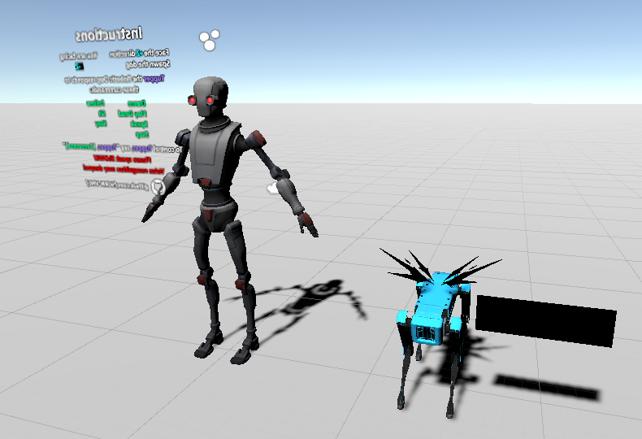
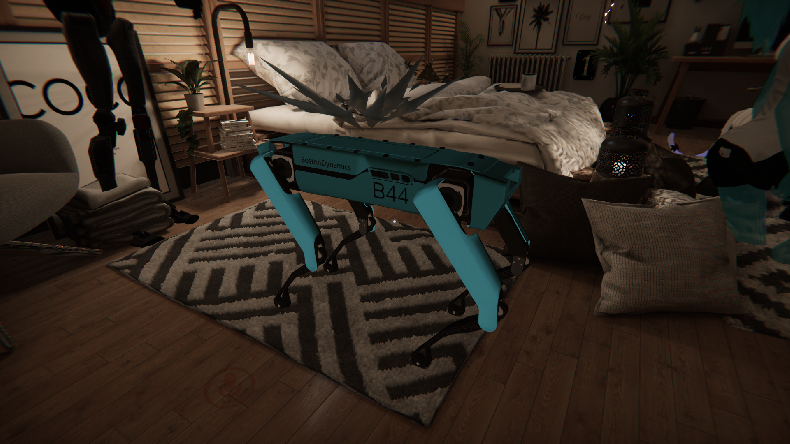

# Voice Recognition Shader
 Audio detection with visemes controlling a robot doggo done with shaders.

## Demo

For people that can clone the avatar by ID
* https://vrchat.com/home/avatar/avtr_c270cd25-9e71-40cb-916f-6f588519cea4

## Setup
#### Prerequisites
* [VRChat SDK3 - Avatars](https://vrchat.com/home/download)

1. Clone the repo or download the latest Release
2. Have the VRChat SDK3 - Avatars loaded
3. Open the "Voice Recognition Scene" in the Scenes folder
4. Upload the avatar to your account
 
## Questions
#### Can I add this to my own avatar?
* No, the setup I do to read the visemes from shaders is too difficult to replicate

#### Why do I need to face the +Z direction
* I don't know but the initial rotation of the model matters. Since the doggo faces +Z, you have to face the same direction as the doggo or else it'll have trouble facing you

# Resources
https://sketchfab.com/3d-models/spot-mini-rigged-5dcbee77730640269cef5bd2587e328a
Spot Mini (Rigged) by Greg McKechnie

https://assetstore.unity.com/packages/3d/characters/robots/space-robot-kyle-4696
Space Robot Kyle by Unity

https://bowlroll.net/file/58197
チルノver.2017.09.09 by 追憶の機械人形

https://github.com/VRLabs/VRChat-Avatars-3.0
World Constraint by lindesu

Thanks d4rkpl4y3r and Merlin for the help on the code. And thanks to everyone that provided training data for the voice recognition: FreelancerB10, Morioh, Reda-Ou, ScruffyRuffles, orels1, uoppoH, んなあぁ