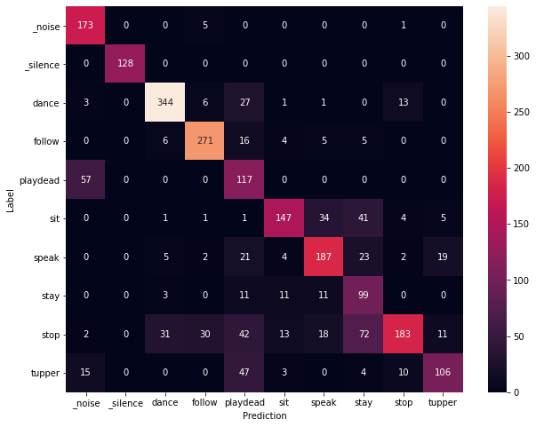
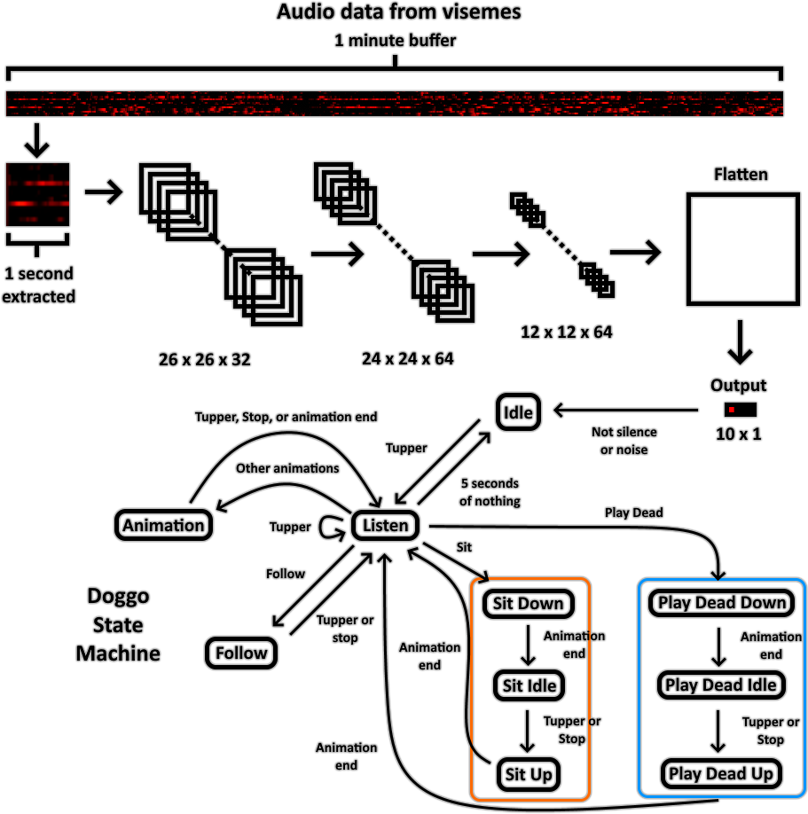

# Voice Recognition Shader
 Audio detection with visemes controlling a robot doggo done with shaders.

## Demo
Video Link
* https://twitter.com/SCRNinVR/status/1367343416644886531

For people that can clone the avatar by ID
* https://vrchat.com/home/avatar/avtr_c270cd25-9e71-40cb-916f-6f588519cea4

## Setup
#### Prerequisites
* LATEST [VRChat SDK3 - Avatars](https://vrchat.com/home/download), older SDK versions will not work with the project

1. Clone the repo or download the latest Release
2. Have the VRChat SDK3 - Avatars loaded
3. Open the "Voice Recognition Scene" in the Scenes folder
4. Upload the avatar to your account
 
## Questions
#### Can I add this to my own avatar?
* No, the setup I do to read the visemes for the shaders is too difficult to replicate on every different avatar.

#### Why do I need to face the +Z direction
* I don't know but the initial rotation of the model matters. Since the doggo faces +Z, you have to face the same direction as the doggo or else it'll have trouble facing you.

# How It Works

## Voice Recognition Convolutional Neural Network (CNN)
* ~40 minutes of training data gathered from volunteers and scraped off YouTube.
* The 14 visemes are ordered from **bottom to top** in the following order: **PP, FF, TH, DD, kk, CH,SS, nn, RR, aa, E, ih, oh, ou**, from the picture above.
* The network was trained in Python using tensorflow and baked into a texture using /Editor/BakeWeightsVoiceCNN.cs.
* If you wish to train your own network, please refer to [Python Code](#python-code).

#### VisemesToFloats.shader
* Two invisible triangles were added to the mesh of Robot Kyle. The XYZ positions of the vertices corresponds to 3 of the 14 visemes. For example, the position of one of the vertices would be (PP, FF, TH). If PP were active, then the vertex would move to (1, 0, 0) from (0, 0, 0). The vertex positions are rendered as color with this geometry shader for the neural network.

#### InputToBuffer.shader
* Takes the output of VisemesToFloats.shader and appends it to a buffer 1 minute long. It samples viseme outputs at 30 bauds.

#### VoiceRecognition.shader, VoiceCNN.cginc
* Takes ~1 second of the output of InputToBuffer.shader and does math on it. It uses the network weights that are baked in a 1024x1024 RFloat texture stored in /Weights/WeightsTex.asset.
* The classification of \_silence, \_noise, dance, follow, play dead, sit, speak, stay, stop, and tupper labels are rendered at X:404, Y:0 with a width of 10.

## Animations
* Max of 12 animations, max animation length of 40 key frames. Values are hard coded, if you wish to change this you'll have to modify BakeBones.cs, BRDF DoggoSkelly.shader, and ControllerInclude.cginc.

#### BakeBones.cs
* Takes a game object with an animator. The animator with all the animations is located inside /Models/Spot/Animations/SpotMini.controller.
* Bakes the animations in the order its listed inside the Animator window. Outputs to /Models/Spot/Animations/BakedAnims.asset.

#### BRDF DoggoSkelly.shader
* Rotates and translates all the parts of the doggo based on the state machine and the baked animations.

## Doggo State Machine

#### Controller.shader, ControllerInclude.cginc
* Controls the state machine based on the VoiceRecognition.shader output. The controller samples the output for ~1 second and looks for the label that appears the most amount of times. This is to suppress any noisy predictions. The state machine then reacts accordingly based on its current state as given by the figure above.
* The controller also outputs a timer for the animations, doggo position, and doggo rotation matrix to BRDF DoggoSkelly.shader.

## Python Code
If you wish to run the Python code, here's what you need.
* Anaconda 1.19.12
* Python 3.7
* TensorFlow 1.14.0
* Keras 2.3.1

I suggest following a guide on Keras + Anaconda installations like this one https://inmachineswetrust.com/posts/deep-learning-setup/

## C++ Code
If you wish to run the C++ code.
* [OpenCV – 4.0 or above](https://opencv.org/releases/)

You can follow a guide on OpenCV + Visual Studio here https://www.deciphertechnic.com/install-opencv-with-visual-studio/

# Resources
1. https://sketchfab.com/3d-models/spot-mini-rigged-5dcbee77730640269cef5bd2587e328a
Spot Mini (Rigged) by Greg McKechnie

2. https://assetstore.unity.com/packages/3d/characters/robots/space-robot-kyle-4696
Space Robot Kyle by Unity

3. https://bowlroll.net/file/58197
チルノver.2017.09.09 by 追憶の機械人形

4. https://github.com/VRLabs/VRChat-Avatars-3.0
World Constraint by lindesu

* Thanks d4rkpl4y3r and [Merlin](https://github.com/MerlinVR) for the help on the code.

* And thanks to everyone that provided training data for the voice recognition: FreelancerB10, Morioh, Reda-Ou, [ScruffyRuffles](https://github.com/ScruffyRules), [orels1](https://github.com/orels1), uoppoH, んなあぁ